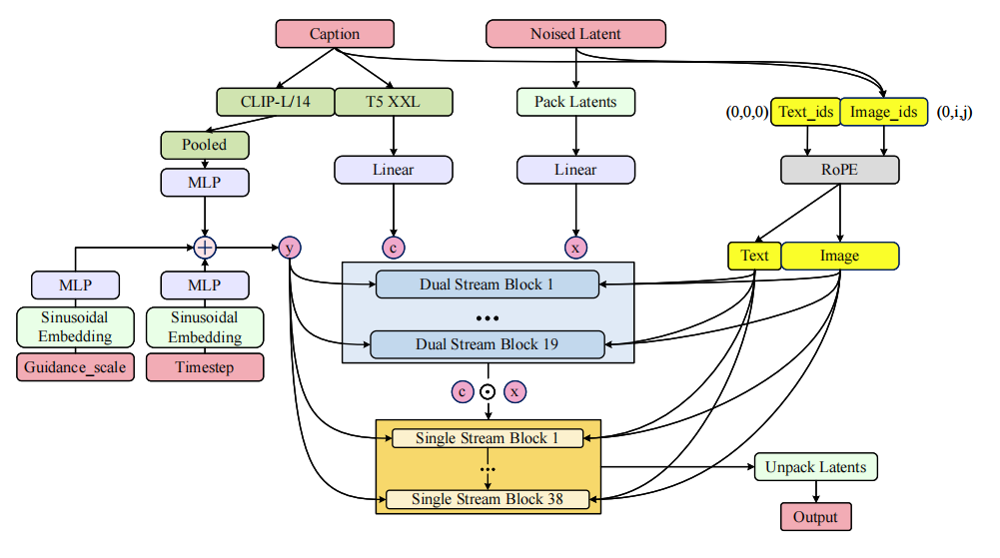
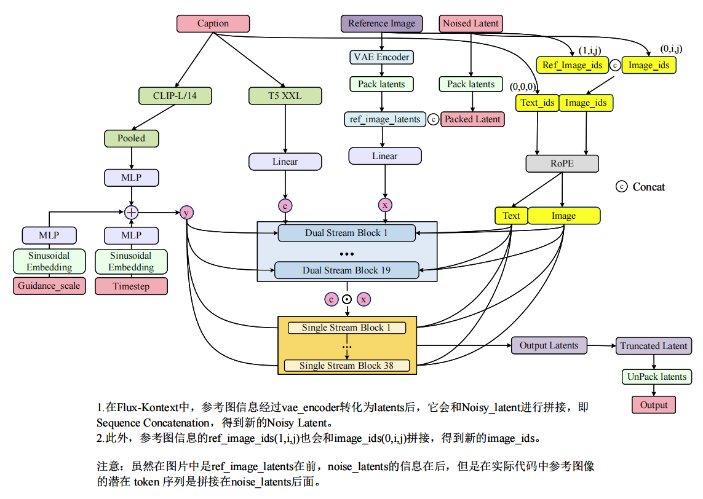
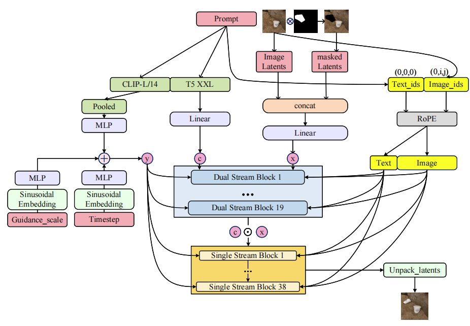
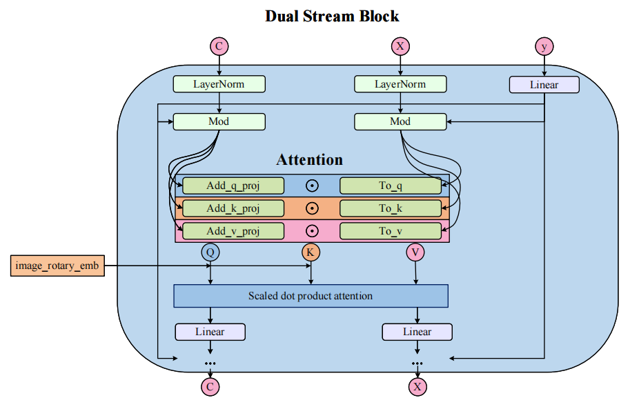
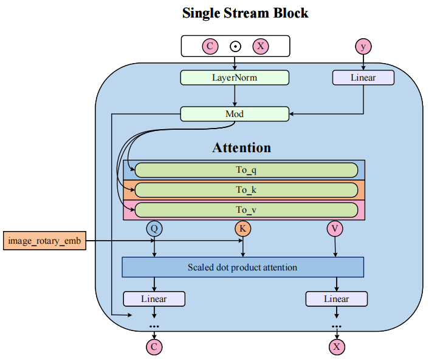

# flux diagrams

## Flux dev text2image pipeline

## Flux kontext pipeline

## Flux inpaint/outpaint pipeline

## Flux dual stream block architecture

## Flux single stream block architecture

## Acknowledgements

- [Flux-diffusers](https://huggingface.co/docs/diffusers/main/en/api/pipelines/flux)
- [EraseAnything with Flux](https://arxiv.org/pdf/2412.20413)
- [FLUX.1 源码深度前瞻解读](https://zhouyifan.net/2024/09/03/20240809-flux1/)