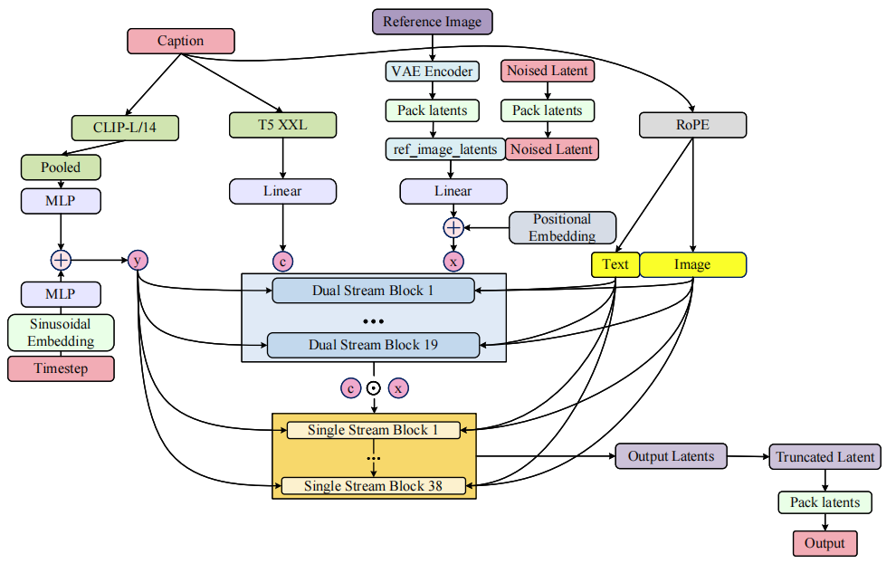

# flux diagrams

## Flux dev architecture

## Flux kontext architecture

## Flux inpaint/outpaint pipeline

## Flux dual stream block

## Flux single stream block

## Acknowledgements

- [Flux-diffusers](https://huggingface.co/docs/diffusers/main/en/api/pipelines/flux)
- [EraseAnything with Flux](https://arxiv.org/pdf/2412.20413)